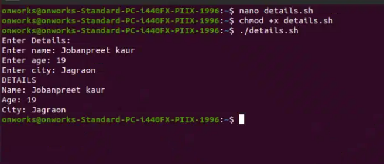

# Daily Report
## 1st day of training
**Orientation**

Started the day with the introduction to our parent department, Computer Science and Engineering in the auditorium. Dr Priyanka introduced us with our department, about departmental library, socities and clubs, faculty. Then Dr Kiran Jyoti (Head of Deparment) gave us a brief overview about the syllabus, new pattern and the changes made to the scheme. Afterwards, we were guided to our respective labs.

**Introduction to linux:**
Linux was developed by a person named Linus in 1991. Linux is a powerful, open source operating system.

*Linux is preferred over windows due to its numerous features:*

Open Source & Free

Stability & Reliability

Provides Security

Run efficiently

Developer Friendly

**Difference between Linux and Windows**
| Features | Linux | Windows |
| :---: | :---: | :---: |
| Cost | Usually free | Paid license required |
| Source code | Open source(free to access) | Not an open source |
| Security | It is more secure as admin password is required | It is not secure as there is a risk of viruses |
| Stability | Very stable | Can be less stable |
| Customizability | Linux offers extensive customization options, allowing users to modify everything from the desktop environment to the core components | Windows provides limited customization compared to Linux, with more rigid control over the core structure and functionalities |

**Installing Linux Operating System**

It include installation of three softwares:

*Steps:-*

1.Oracle Virtual Machine https://download.virtualbox.org/virtualbox/7.0.20/VirtualBox-7.0.20-163906-Win.exe 

*Oracle virtual box is a powerful, open-source virtualization software that allows users to run multiple operating systems on a single machine, making it ideal for development, testing, and deployment.Thus, it is installed first as it enables users to run operating systems such as Windows , macOS, Linux.*

2.Microsoft Visual C++ https://download.visualstudio.microsoft.com/download/pr/40b59c73-1480-4caf-ab5b-4886f176bf71/D62841375B90782B1829483AC75695CCEF680A8F13E7DE569B992EF33C6CD14A/VC_redist.x64.exe

3.Ubuntu 24.04.2 https://login.gndec.ac.in/ubuntu-24.04.2-desktop-amd64.iso

4.After installing Oracle virtual machine and Microsoft Visual C++, install Ubuntu 24.04.02.

5.Set Up Ubuntu in VirtualBox:

    Open VirtualBox

    Click New > Name: e.g., Ubuntu VM

    Select the path of Ubuntu in iso image

    Set:
            Type: Linux
            Version: Ubuntu (64-bit)
    
    Enter the username and password

    Set the required memory space and processors

**Product based companies:**

- Develop and sell their own products
- Earn from selling/licensing products
- Google, Microsoft, Adobe, Apple
- Own and maintain their own codebase

**Service based companies:**

- Provide services or solutions to other businesses
- Earn from client contracts
- Infosys, TCS, Wipro, Accenture
- Work on client-owned codebases

**Startups:**

- Startups are newly established companies aiming to solve problems with innovative solutions.
- They focus on rapid growth and scalability, often with limited resources.
- Common goal: grow fast, get acquired, or go public

**Career Opportunities Using Linux**

1. System Administrator

2. DevOps Engineer

3. Cloud Engineer

4. Linux Administrator

5. Cybersecurity Analyst

6. QA/Test Engineer

7. Database Administrator

8. Software Developer

**Booting**

Booting is the process of starting up a computer and loading the operating system (OS) into the computer's memory so that it can be used. When you turn on a computer, it performs a series of steps to prepare the hardware and software for use.

**Types of Booting**

1.Cold Booting (Hard Booting)

This happens when you turn on the computer from a completely powered-off state. Examples include Linux and MacOS.

2.Warm Booting (Soft Booting)

This happens when you restart the computer without turning off the power completely. Examples include Windows.

## 2nd day of training

In today's class, we learnt about:

**Kernel**

The kernel is the core part of an operating system. It acts as a bridge between the computer hardware and the software applications. The kernel manages system resources such as the CPU, memory, and input/output devices, ensuring that programs run smoothly and efficiently.

**Shell**

The shell is a user interface that allows you to interact with the operating system. It takes commands from the user and tells the OS what to do.

**Types of Shells**

bash: Enhanced sh with more features, widely used on Linux.

sh: Basic Unix shell, mainly for scripting and compatibility.

zsh: Feature-rich, highly customizable shell popular among power users.

fish: User-friendly shell with smart features and easy syntax.

**Categories of Shells:**

- Command-Line Shell: You type text commands (like in Windows Command Prompt or Linux Terminal).
- Graphical Shell: You use graphical elements like icons and menus (like Windows Explorer or macOS Finder).

**File System Structure (/, /home, /etc, /var etc)**

The root directory, represented by a single slash /, is the top-level directory of the entire Linux file system hierarchy. All files and directories branch out from this root directory.

| Directory | Description |
|-----------|-------------|
| `/`       | Root directory – the top of the file system |
| `/bin`    | Essential binary commands |
| `/boot`   | Boot loader files, including the Linux kernel |
| `/dev`    | Device files |
| `/etc`    | Configuration files for the system and applications |
| `/home`   | User home directories |
| `/lib`    | Shared libraries needed by programs in bin and sbin |
| `/media`  | Mount point for removable media |
| `/mnt`    | Temporary mount point for filesystems |
| `/opt`    | Optional software and third-party applications |
| `/proc`   | Virtual filesystem for system information (kernel, processes) |
| `/root`   | Home directory for the root user |
| `/run`    | Runtime data for processes |
| `/sbin`   | System administration binaries |
| `/srv`    | Data for services like FTP, web servers |
| `/tmp`    | Temporary files (cleared on reboot) |
| `/usr`    | User applications and files |
| `/var`    | Variable data |

**Commands**

Commands are instructions you type into the terminal to tell the computer to perform specific tasks like managing files, running programs, or checking system status.

**ls** - Lists files and directories

**whoami** - Displays the username of the current user.

**date** - Displays the current date and time of the system.

**cd** - Changes the current directory

**mkdir** - Creates a new directory

**cat** - Displays contents of a file

**touch** - creates empty files or updates the modification time of existing files.

**whereis** - Locates the binary, source, and manual files for a command.

**whatis** - Gives a one-line description of a command or program.

**pwd** - Shows the current directory path

**ASSIGNMENT**

**cp** - Copies files or directories

**mv** - Moves or renames files or directories

## 3rd day of training
**Bare metal installation**

Bare metal installation refers to installing an operating system (OS), software, or virtualization environment directly on the physical hardware of a server or computer, without any pre-installed OS or virtualization layer.

**VMware and virtual box**

| Feature           | VMware                              | VirtualBox                          |
|-------------------|--------------------------------------|--------------------------------------|
| Cost              | Paid (some free versions)            | Free and open-source                 |
| Performance       | Faster and more stable               | Slower, good for light use           |
| Use Case          | Best for professionals and servers   | Great for learning and testing       |
| Ease of Use       | Very polished                        | Simple and beginner-friendly         |
| Advanced Features | More enterprise tools                | Basic features                       |

**Dual boot**

Dual boot means installing two operating systems (OSes) on the same computer, so you can choose which one to use when the computer starts.

**Partitioning Schemes**

**MBR**

MBR (Master Boot Record) is an older partitioning system used on hard drives.
- Works on most old computers (BIOS systems).
- Can have up to 4 primary partitions.
- Supports drives up to 2 TB only.
  
**GPT**

GPT (GUID Partition Table) is a newer and better partitioning system used with modern computers.
- Supports more than 100 partitions.
- Works with large hard drives (over 2 TB).
- Stores multiple copies of data for safety.

**ISO**

An ISO file (or ISO image) is a copy of an entire CD, DVD, or installation disc saved as a single file. It's often used to distribute operating systems or software.

**FILE AND DIRECTORY PERMISSIONS**

Permissions control who can read, write, or execute a file or directory.

🔹**chmod**

chmod stands for change mode — it changes file or directory permissions.

Syntax: chmod +x filename.sh

**+x** changes the file to executable

🔹**chmod 444**

It sets the permissions of a file or directory to read-only for everyone:

- Owner, Group, and Others can only read the file.
- No one can modify (write) or run (execute) it.

Syntax: chmod 444 filename.sh

🔹**chmod 644**

Gives permission only to the owner.

It sets the file permissions so that:

- The owner can read and write the file.
- The group and others can only read the file.
- No one has execute permission.
  
Syntax: chmod 644 filename.sh

**ECHO**

echo is a command used to display text or variables to the screen or redirect them elsewhere (like into a file). It's available in Linux, Unix, Windows CMD, and many programming languages. It can be used for creating a file.

Syntax - echo text > filename.txt

**REDIRECTION**

Redirection is the process of changing the flow of input or output in computing. It tells a system to send data somewhere else instead of using the default path.

Redirection lets you:

- Take input from a file instead of typing it.
- Send output to a file instead of the screen.
- Save error messages separately.

**Types of Redirection**

1. Standard Output Redirection (>)

Purpose: Sends output to a file (overwrites if it exists).

Example:

ls > files.txt

Saves output of ls to files.txt.

2. Append Output (>>)
    
Purpose: Sends output to a file without overwriting.

Example:

echo "New line" >> notes.txt

3. Standard Input Redirection (<)

Purpose: Takes input from a file instead of keyboard.

Example:

sort < names.txt

Sorts the contents of names.txt.

**PIPES**

Pipes (|) in Linux are used to connect the output of one command directly into the input of another — creating powerful command chains.

**Basic Syntax**

command1 | command2

- command1 → produces output
- command2 → takes that output as input

**How Pipes Work**

Behind the scenes:

- Each command runs in its own process.
- The stdout (standard output) of the first command is connected to the stdin (standard input) of the next command.

🔸**Wildcards**

Wildcards let you match filenames or strings with patterns. They're often used with commands like ls, cp, mv, and rm.

Examples - *.sh, file?.txt

| Wildcard | Meaning                      | Example                      |
|----------|------------------------------|------------------------------|
| `*`      | Matches zero or more characters | `*.txt` matches all `.txt` files |
| `?`      | Matches exactly one character | `file?.txt` matches `file1.txt`, `fileA.txt` |
| `[abc]`  | Matches one character listed  | `file[123].txt` matches `file1.txt`, `file2.txt`, or `file3.txt` |

**FILE COMPRESSION**

File compression is the process of reducing the size of a file by encoding its data more efficiently. This helps save disk space and makes it faster to transfer files over networks.

**How It Works:**

- Removing Redundancy: Compression algorithms look for patterns or repeated data in the file and represent them in a shorter way.
- Encoding Data: Instead of storing repeated data multiple times, the algorithm stores it once and uses references, codes, or symbols to represent repeated parts.

| Command                 | Syntax                     | Description                                                      |
|-------------------------|----------------------------|------------------------------------------------------------------|
| Compress file           | `gzip file.txt`             | Compress `file.txt` → creates `file.txt.gz`                      |
| Decompress file         | `gunzip file.txt.gz`        | Decompress `file.txt.gz` → restores `file.txt`                   |
| Compress & keep original| `gzip -k file.txt`          | Compress but **keep** original file                              |

**ASSIGNMENT**

**chown**

The chown command in Linux is used to change the ownership of files or directories. It lets you set the user and/or group that owns a file.

Syntax - chown [options] new_owner[:new_group] file_or_directory

- new_owner: the username or user ID to become the new owner
- new_group (optional): the group name or group ID to become the new group owner
- file_or_directory: the file or directory to change ownership for

**To read and display the details of a person using variables**

**Multiplication table of any number**

**Comaparing two variables**

🔸**Escape Characters**

Escape characters let you prevent special interpretation of characters.

Examples - \*, \$, \"

| Escape Sequence | Meaning                           | Example                                           |
|-----------------|---------------------------------|---------------------------------------------------|
| `\`             | Escape next character literally | `rm file\*.txt` deletes a file literally named `file*.txt` |
| `\\`            | Literal backslash                | `echo "C:\\Users"` outputs `C:\Users`             |
| `\n`            | Newline (in scripts or echo -e) | `echo -e "Hello\nWorld"` prints on two lines      |
| `\t`            | Tab (in scripts or echo -e)      | `echo -e "Name\tAge"` outputs a tab between words |

🔸**Quoting**

Quoting controls how the shell interprets special characters (like $, *, !, &, etc.).

Quoting is enclosing text in single (') or double (") quotes to tell the shell to treat the enclosed characters literally or with some rules, preventing special characters (like wildcards, spaces, $, !, etc.) from being interpreted by the shell.

Examples - 'literal', "$var"

| Quote Type          | Description                                                    | Example                             |
|---------------------|----------------------------------------------------------------|-----------------------------------|
| Single quotes '...'  | Preserve the literal value of all characters inside. No expansion or interpretation happens. | 'file*.txt' — wildcard * treated literally, no matching |
| Double quotes "..."  | Preserve literal characters except $, `, and \. Variables and command substitution still work. | "file*.txt" — wildcard not expanded, but $VAR will be replaced |
| No quotes           | Shell interprets special characters like wildcards, variables, etc. | file*.txt — wildcard expanded to match files |

## 4th Day of training
## HARDWARE

**What is Hardware?**

Hardware refers to the physical components of a computer system or electronic device. These are the tangible parts you can see and touch.

**Common hardware components**

- Processor
- RAM (Memory)
- Storage Devices (HDD, SSD)
- Motherboard
- Power Supply Unit (PSU)
- Input Devices (Keyboard, Mouse)
- Output Devices (Monitor, Printer)
- Graphics Card (GPU)

**Motherboard**

The motherboard is the main printed circuit board (PCB) inside a computer that connects and allows communication between all the hardware components.

**Key Functions:**

- Connects Components: Links CPU, RAM, storage devices, graphics cards, and peripherals.
- Power Distribution: Supplies power to components through power connectors.
- Communication Hub: Enables data transfer between CPU, memory, and other devices via buses and chipsets.
- Houses Slots and Ports: Contains slots for RAM, PCIe cards, and ports for USB, audio, network, etc.

  
**Parts of a motherboard**

| Part                 | Description & Function                                                                                   |
|----------------------|--------------------------------------------------------------------------------------------------------|
| **CPU Socket**       | The slot where the Central Processing Unit (CPU) is installed. Connects the processor to the motherboard and provides electrical contacts for data and power. Different CPUs require different socket types (e.g., LGA 1200, AM4). |
| **RAM Slots (DIMM Slots)** | Slots where memory modules (RAM) are installed. The number and type (DDR3, DDR4, DDR5) determine the system’s memory capacity and speed. These slots connect the RAM directly to the CPU via the memory controller. |
| **Chipset**          | Manages communication between the CPU, RAM, storage, and peripherals. Controls data flow and connectivity features. Modern chipsets combine Northbridge and Southbridge functions. |
| **Expansion Slots (PCIe Slots)** | Slots for adding expansion cards like graphics cards (GPUs), sound cards, network cards, or USB controllers. PCI Express (PCIe) is the standard interface, with different sizes (x1, x4, x8, x16) affecting bandwidth. |
| **Storage Connectors** | Ports where storage devices like HDDs and SSDs connect. Common types include SATA ports and M.2 slots for NVMe SSDs offering faster speeds. |
| **Power Connectors** | Connectors linking the motherboard to the power supply unit (PSU). Includes 24-pin main power and 4/8-pin CPU power connectors. |
| **BIOS/UEFI Chip**   | Memory chip containing firmware (BIOS or UEFI) that initializes hardware during startup and provides system configuration interface. |
| **CMOS Battery**     | Small battery powering CMOS memory storing BIOS settings when PC is off. Preserves system clock and configuration data. |
| **Audio Chip/Ports** | Integrated audio processing chip and connectors for sound input/output, including headphone and microphone jacks. |
| **Network Interface (Ethernet Port)** | Onboard network controller and port for wired internet connections. Some motherboards include built-in Wi-Fi modules. |
| **Cooling Fan Headers** | Connectors for system and CPU fans, allowing motherboard control over fan speeds for temperature management. |
